```mermaid
classDiagram
    direction TB

    %% ─────────────────────────────────────────
    %% CONTROLLERS
    %% ─────────────────────────────────────────
    class SessionController {
        -BrowserEngineService engine
        +create(CreateSessionReq) CreateSessionRes
        +listSessions() SessionSummary[]
        +undo(sid) boolean
        +redo(sid) boolean
        +evictions(sid) EvictionEntry[]
        +activity(sid) ActivityEntry[]
    }

    class TabController {
        -BrowserEngineService engine
        +open(sid, OpenTabReq) OpenTabRes
        +access(sid, tid) void
        +close(sid, tid) void
        +list(sid) TabRecord[]
        +lru(sid) int[]
    }

    class AnalyticsController {
        -BrowserEngineService engine
        +topTabs(sid, k, windowSeconds) CountEntry[]
    }

    %% ─────────────────────────────────────────
    %% SERVICE LAYER
    %% ─────────────────────────────────────────
    class BrowserEngineService {
        +TAB_TTL_MILLIS : long
        +SESSION_TTL_MILLIS : long
        +ANALYTICS_WINDOW_MILLIS : long
        -SessionDao sessionDao
        -TabDao tabDao
        -AccessLogDao accessLogDao
        -ActivityLogDao activityLogDao
        -EvictionLogDao evictionLogDao
        -RuntimeStore runtimeStore
        +createSession(capacity) int
        +openTab(sessionId, url) int
        +closeTab(sessionId, tabId) void
        +accessTab(sessionId, tabId) void
        +undo(sessionId) boolean
        +redo(sessionId) boolean
        +topK(sessionId, k, windowSeconds) CountEntry[]
        +listSessions() DynamicArray~SessionSummary~
        +listTabs(sessionId) DynamicArray~TabRecord~
        +evictions(sessionId) DynamicArray~EvictionEntry~
        +activity(sessionId) DynamicArray~ActivityEntry~
        +lruOrder(sessionId) int[]
        +expireTabById(tabId) void
        +expireSessionById(sessionId) void
    }

    class SessionRuntime {
        +sessionId : int
        +commandManager : CommandManager
        +analytics : AnalyticsService
        +expiration : ExpirationManager
        +lru : LruTabManager
    }

    class RuntimeStore {
        -CustomHashMap~Integer, SessionRuntime~ map
        +get(sessionId) SessionRuntime
        +put(sessionId, rt) void
        +forEach(visitor) void
    }

    class LruTabManager {
        -DoublyLinkedList~Integer~ list
        -CustomHashMap~Integer, DoublyNode~ nodeByTabId
        +addToFront(tabId) void
        +remove(tabId) void
        +touch(tabId) void
        +peekLeastRecentlyUsed() int
        +pickEvictionCandidate(activeTabId) int
        +snapshotOrder() int[]
        +restoreOrder(order) void
        +size() int
        +clear() void
    }

    class AnalyticsService {
        -CustomDeque~AccessEvent~ windowQ
        -CustomHashMap~Integer, Integer~ counts
        +recordAccess(tabId, nowMillis, windowMillis) void
        +topK(k, nowMillis, windowMillis) CountEntry[]
        +undoLastAccess(tabId, timeMillis, nowMillis, windowMillis) boolean
    }

    class ExpirationManager {
        -MinHeap~ExpiryEvent~ heap
        -CustomHashMap~Integer, Integer~ versionMap
        -ExpireCallback callback
        +scheduleTabExpiry(tabId, expiresAtMillis) void
        +scheduleSessionExpiry(sessionId, expiresAtMillis) void
        +cancelTabExpiry(tabId) void
        +cancelSessionExpiry(sessionId) void
        +expireDue(nowMillis) int
    }

    class ExpireCallback {
        <<interface>>
        +expireTab(tabId) void
        +expireSession(sessionId) void
    }

    %% ─────────────────────────────────────────
    %% COMMAND PATTERN
    %% ─────────────────────────────────────────
    class Command {
        <<interface>>
        +execute() void
        +undo() void
        +name() String
    }

    class CommandManager {
        -CustomStack~Command~ undoStack
        -CustomStack~Command~ redoStack
        +executeCommand(cmd) void
        +undo() boolean
        +redo() boolean
        +undoSize() int
        +redoSize() int
    }

    class OpenTabCommand {
        -int sessionId
        -String url
        -int openedTabId
        -TabRecord openedRecord
        -DynamicArray~TabRecord~ evictedRecords
        -int prevActiveTabId
        -int[] prevLruOrder
        +execute() void
        +undo() void
        +name() String
        +getOpenedTabId() int
    }

    class AccessTabCommand {
        -int sessionId
        -int tabId
        -int prevActiveTabId
        -int[] prevLruOrder
        -long recordAccessTimeMillis
        +execute() void
        +undo() void
        +name() String
    }

    class CloseTabCommand {
        -int sessionId
        -int tabId
        -TabRecord closedRecord
        -int prevActiveTabId
        -int[] prevLruOrder
        +execute() void
        +undo() void
        +name() String
    }

    %% ─────────────────────────────────────────
    %% DAO LAYER
    %% ─────────────────────────────────────────
    class SessionDao {
        -DataSource ds
        +createSession(maxCapacity, nowMillis, expiresAtMillis) int
        +getMaxCapacity(sessionId) int
        +updateLastActiveAndExpiry(sessionId, lastActiveMillis, expiresAtMillis) void
        +setStatus(sessionId, status) void
        +listSessions() DynamicArray~SessionSummary~
    }

    class TabDao {
        -DataSource ds
        +insertTab(sessionId, url, isActive, nowMillis, expiresAtMillis) int
        +insertTabWithId(TabRecord) void
        +deleteTab(tabId) void
        +getTabRecord(tabId) TabRecord
        +updateAccessAndExpiry(tabId, lastAccessMillis, expiresAtMillis) void
        +setActiveTab(sessionId, tabId) void
        +getActiveTabId(sessionId) int
        +countTabsInSession(sessionId) int
        +listTabsInSession(sessionId) DynamicArray~TabRecord~
    }

    class AccessLogDao {
        -DataSource ds
        +insertAccess(tabId, accessTimeMillis) void
    }

    class ActivityLogDao {
        -DataSource ds
        +insert(sessionId, operation, details) void
        +listBySession(sessionId) DynamicArray~ActivityEntry~
    }

    class EvictionLogDao {
        -DataSource ds
        +insert(sessionId, tabId, reason) void
        +listBySession(sessionId) DynamicArray~EvictionEntry~
    }

    %% ─────────────────────────────────────────
    %% DOMAIN (DTOs)
    %% ─────────────────────────────────────────
    class TabRecord {
        +int tabId
        +int sessionId
        +long createdAtMillis
        +String url
        +boolean isActive
        +long lastAccessAtMillis
        +long expiresAtMillis
    }

    class SessionSummary {
        +int sessionId
        +String status
        +int maxCapacity
        +long lastActiveAtMillis
        +long expiresAtMillis
    }

    class EvictionEntry {
        +int evictionId
        +int sessionId
        +int tabId
        +String reason
        +long evictedAtMillis
    }

    class ActivityEntry {
        +int logId
        +int sessionId
        +String operation
        +String details
        +long createdAtMillis
    }

    class CountEntry {
        +int tabId
        +int count
        +compareTo(other) int
    }

    class AccessEvent {
        +long timeMillis
        +int tabId
    }

    class ExpiryEvent {
        +long expiresAtMillis
        +int type
        +int id
        +int version
        +compareTo(other) int
    }

    %% ─────────────────────────────────────────
    %% DSA LAYER
    %% ─────────────────────────────────────────
    class DynamicArray~T~ {
        -Object[] data
        -int size
        +add(value) void
        +get(index) T
        +set(index, value) void
        +removeLast() T
        +size() int
        +isEmpty() boolean
        +clear() void
    }

    class CustomStack~T~ {
        -DynamicArray~T~ arr
        +push(value) void
        +pop() T
        +peek() T
        +size() int
        +isEmpty() boolean
        +clear() void
    }

    class CustomHashMap~K,V~ {
        -Object[] keys
        -Object[] values
        -byte[] states
        -int size
        +get(key) V
        +put(key, value) V
        +remove(key) V
        +containsKey(key) boolean
        +size() int
        +clear() void
        +forEach(visitor) void
    }

    class DoublyLinkedList~T~ {
        -DoublyNode~T~ head
        -DoublyNode~T~ tail
        -int size
        +addFirst(value) DoublyNode~T~
        +addLast(value) DoublyNode~T~
        +removeFirst() T
        +removeLast() T
        +removeNode(node) void
        +moveToFront(node) void
        +headNode() DoublyNode~T~
        +tailNode() DoublyNode~T~
        +size() int
        +clear() void
    }

    class DoublyNode~T~ {
        +T value
        +DoublyNode~T~ prev
        +DoublyNode~T~ next
    }

    class CustomDeque~T~ {
        -DoublyLinkedList~T~ list
        +pushBack(value) void
        +pushFront(value) void
        +popFront() T
        +popBack() T
        +peekFront() T
        +peekBack() T
        +size() int
        +isEmpty() boolean
    }

    class MinHeap~T~ {
        -Object[] data
        -int size
        +push(value) void
        +pop() T
        +peek() T
        +size() int
        +isEmpty() boolean
    }

    class MaxHeap~T~ {
        -Object[] data
        -int size
        +push(value) void
        +pop() T
        +peek() T
        +size() int
        +isEmpty() boolean
    }

    %% ─────────────────────────────────────────
    %% RELATIONSHIPS
    %% ─────────────────────────────────────────

    %% Controllers → Service
    SessionController --> BrowserEngineService : uses
    TabController --> BrowserEngineService : uses
    AnalyticsController --> BrowserEngineService : uses

    %% Service → DAOs
    BrowserEngineService --> SessionDao : uses
    BrowserEngineService --> TabDao : uses
    BrowserEngineService --> AccessLogDao : uses
    BrowserEngineService --> ActivityLogDao : uses
    BrowserEngineService --> EvictionLogDao : uses
    BrowserEngineService --> RuntimeStore : uses

    %% Service → Runtime
    BrowserEngineService ..|> ExpireCallback : implements
    RuntimeStore --> SessionRuntime : stores
    SessionRuntime --> CommandManager : has
    SessionRuntime --> AnalyticsService : has
    SessionRuntime --> ExpirationManager : has
    SessionRuntime --> LruTabManager : has

    %% Commands
    Command <|.. OpenTabCommand : implements
    Command <|.. AccessTabCommand : implements
    Command <|.. CloseTabCommand : implements
    CommandManager --> Command : manages
    CommandManager --> CustomStack : uses

    %% ExpirationManager
    ExpirationManager --> MinHeap : uses
    ExpirationManager --> CustomHashMap : uses
    ExpirationManager --> ExpireCallback : calls

    %% LruTabManager
    LruTabManager --> DoublyLinkedList : uses
    LruTabManager --> CustomHashMap : uses

    %% AnalyticsService
    AnalyticsService --> CustomDeque : uses
    AnalyticsService --> CustomHashMap : uses
    AnalyticsService --> MaxHeap : uses

    %% DSA internal
    CustomStack --> DynamicArray : uses
    CustomDeque --> DoublyLinkedList : uses
    DoublyLinkedList --> DoublyNode : contains

    %% Domain used by DAOs
    SessionDao --> SessionSummary : returns
    TabDao --> TabRecord : returns
    EvictionLogDao --> EvictionEntry : returns
    ActivityLogDao --> ActivityEntry : returns
    AnalyticsService --> CountEntry : returns
    AnalyticsService --> AccessEvent : stores
    ExpirationManager --> ExpiryEvent : stores
```

<div align="center">

# 🌐 Browser Session Management System
### DSA-Based Semester Project — Spring Boot + MySQL + Vanilla JS UI


> A complete browser-session simulation built to demonstrate **Data Structures & Algorithms** in a real, working backend system.
> Manages sessions and tabs with **LRU eviction**, **undo/redo**, **expiration scheduling**, and **Top-K analytics** — all powered by **custom data structures** (no Java Collections used).

</div>

---

## 📑 Table of Contents

- [Project Summary](#-project-summary)
- [Key Functionalities](#-key-functionalities)
- [DSA & Algorithms Used](#-dsa--algorithms-used)
- [Big-O Complexity Summary](#-big-o-complexity-summary)
- [Tech Stack](#-tech-stack)
- [Project Structure](#-project-structure)
- [Database Setup](#-database-setup)
- [Run the Project](#-run-the-project)
- [API Endpoints](#-api-endpoints)
- [Frontend UI](#-frontend-ui)

---

## 📌 Project Summary

This project simulates how a real browser manages windows and tabs:

| Concept | Meaning in this Project |
|---|---|
| **Session** | A browser window |
| **Tab** | A webpage (URL) opened inside a session |

### ⚠️ Course Constraint
> ✅ **Java built-in Collections and algorithms are NOT used.**
> All data structures — stack, heap, deque, hash map, linked list, dynamic array — are **manually implemented** in the `dsa/` package.

---

## ✨ Key Functionalities

### 1. 🗂️ Session Management
- Create a new browser session with a configurable **max tab capacity**
- List all sessions (populates the UI dropdown)
- Sessions **auto-expire** after 30 minutes via a MinHeap scheduler

### 2. 📄 Tab Management
- **Open** a tab (URL) — becomes the active tab immediately
- **Access** a tab — brings it into focus, refreshes its TTL
- **Close** a tab — manually removes it from the session
- **List** all tabs — shows URL, active/inactive status, last access time, expiry countdown
- **View LRU order** — inspect the internal recency order of tabs

### 3. 🔁 LRU (Least Recently Used) Eviction
When a new tab is opened and the session is already at **max capacity**:
- The system automatically evicts the **Least Recently Used** tab (never the active tab)
- Eviction is recorded in the `eviction_log` table
- Activity is recorded in the `activity_log` table

**Backed by:** Custom Doubly Linked List + Custom HashMap → **O(1)** eviction

### 4. ↩️ Full Undo / Redo System
Every major operation (open, access, close tab) is a **Command** object with:
- `execute()` — applies the change
- `undo()` — fully reverses it (including restoring evicted tabs)

Uses two custom stacks: `undoStack` and `redoStack`. All stack operations are **O(1)**.

### 5. ⏰ Session & Tab Expiration Scheduler
- **Tabs** expire after **10 minutes** of inactivity
- **Sessions** expire after **30 minutes**
- A **custom MinHeap** processes expiry events in time order → **O(log n)** scheduling

### 6. 📊 Analytics — Top-K Most Accessed Tabs
Returns the **K most-accessed tabs** within a sliding time window:

| Parameter | Default |
|---|---|
| `k` | 5 |
| `windowSeconds` | 300 (5 minutes) |

**Algorithm:** Custom Deque (sliding window) + Custom HashMap (frequency counts) + MaxHeap (Top-K extraction)

### 7. 🗄️ Persistent Logging (3 Database Tables)

| Table | What it stores |
|---|---|
| `tab_access_log` | Every tab access event with timestamp |
| `activity_log` | All operations: open, access, close, undo, redo, expire, evict |
| `eviction_log` | Evicted tab records with reason and timestamp |

---

## 🧠 DSA & Algorithms Used

| Algorithm / Structure | Where Used | Purpose |
|---|---|---|
| **Doubly Linked List** | LRU Manager | Maintains recency order of tabs |
| **Custom HashMap** | LRU Manager, Analytics | O(1) node lookup; frequency counting |
| **Custom Stack** | Undo/Redo | Command history management |
| **MinHeap** | Expiration Scheduler | Process expiry events by earliest time |
| **MaxHeap** | Analytics | Extract Top-K most accessed tabs |
| **Custom Deque** | Analytics | Sliding time window for access events |
| **DynamicArray** | General | Resizable array replacing ArrayList |

---

## ⚡ Big-O Complexity Summary

| Operation | Time Complexity |
|---|---|
| Open / Access Tab (LRU update) | **O(1)** |
| LRU Eviction | **O(1)** |
| Undo / Redo | **O(1)** |
| Schedule expiry event | **O(log n)** |
| Process expiry event | **O(log n)** |
| Analytics update (per access) | **O(1)** amortized |
| Analytics Top-K query | **O(n + k log n)** |

---

## 🛠️ Tech Stack

| Layer | Technology |
|---|---|
| **Backend** | Java 17, Spring Boot |
| **Database** | MySQL (via XAMPP / phpMyAdmin) |
| **Frontend** | HTML + CSS + Vanilla JavaScript |
| **Build Tool** | Maven |
| **DB Access** | Raw JDBC (no ORM) |

---

## 📁 Project Structure

```
src/
├── main/
│   ├── java/com/dsa/browsersession/
│   │   ├── controller/          # REST API controllers (Session, Tab, Analytics)
│   │   ├── service/             # Core business logic (BrowserEngineService)
│   │   ├── dao/                 # JDBC DAOs for all MySQL tables
│   │   ├── command/             # Command Pattern (Open/Access/CloseTabCommand)
│   │   ├── dsa/
│   │   │   ├── array/           # DynamicArray
│   │   │   ├── heap/            # MinHeap, MaxHeap
│   │   │   ├── list/            # Doubly Linked List
│   │   │   ├── map/             # Custom HashMap
│   │   │   ├── stack/           # Custom Stack
│   │   │   └── deque/           # Custom Deque
│   │   └── domain/              # DTOs: TabRecord, SessionSummary, EvictionEntry, etc.
│   └── resources/
│       ├── application.properties
│       └── static/
│           ├── index.html       # Frontend UI
│           ├── styles.css       # Light mode styles
│           └── app.js           # UI logic (fetch API calls)
└── test/
```

---

## 🗄️ Database Setup

### Requirements
- XAMPP (MySQL + phpMyAdmin)

### Steps

1. Start **MySQL** from the XAMPP Control Panel
2. Open **phpMyAdmin** → `http://localhost/phpmyadmin`
3. Create a new database:
   ```sql
   CREATE DATABASE browser_session_db;
   ```
4. Import/run the `tables.sql` file from the project root into `browser_session_db`

The following tables will be created:

| Table | Purpose |
|---|---|
| `sessions` | Stores browser window sessions |
| `tabs` | Stores open tabs per session |
| `tab_access_log` | Records every tab access event |
| `activity_log` | Records all operations |
| `eviction_log` | Records LRU evictions |

### Configure `application.properties`
```properties
spring.datasource.url=jdbc:mysql://localhost:3306/browser_session_db
spring.datasource.username=root
spring.datasource.password=        # your MySQL password
spring.datasource.driver-class-name=com.mysql.cj.jdbc.Driver
```

---

## ▶️ Run the Project

### Step 1 — Start MySQL
Open XAMPP Control Panel → Click **Start** next to MySQL

### Step 2 — Run Spring Boot
In **IntelliJ IDEA**:
- Open the project
- Run `BrowserSessionApplication.java`

### Step 3 — Open the UI
Navigate to: **http://localhost:8080**

---

## 🌐 API Endpoints

### Sessions
| Method | Endpoint | Description |
|---|---|---|
| `POST` | `/api/sessions` | Create a new session (`{ "maxCapacity": 3 }`) |
| `GET` | `/api/sessions` | List all sessions |
| `POST` | `/api/sessions/{sid}/undo` | Undo last action |
| `POST` | `/api/sessions/{sid}/redo` | Redo last action |
| `GET` | `/api/sessions/{sid}/evictions` | Get eviction log |
| `GET` | `/api/sessions/{sid}/activity` | Get activity log |

### Tabs
| Method | Endpoint | Description |
|---|---|---|
| `POST` | `/api/sessions/{sid}/tabs` | Open a tab (`{ "url": "https://..." }`) |
| `POST` | `/api/sessions/{sid}/tabs/{tid}/access` | Access/focus a tab |
| `DELETE` | `/api/sessions/{sid}/tabs/{tid}` | Close a tab |
| `GET` | `/api/sessions/{sid}/tabs` | List all tabs in session |
| `GET` | `/api/sessions/{sid}/tabs/lru-order` | View LRU order of tabs |

### Analytics
| Method | Endpoint | Description |
|---|---|---|
| `GET` | `/api/sessions/{sid}/analytics/top-tabs?k=5&windowSeconds=300` | Get Top-K tabs |

---

## 🖥️ Frontend UI

The UI is served directly by Spring Boot from `src/main/resources/static/` and provides:

| Component | Description |
|---|---|
| **Session Selector** | Dropdown to switch between active sessions |
| **Create Session** | Input for capacity + Create button |
| **Undo / Redo Buttons** | Instantly reverses or reapplies the last action |
| **Browser Tab Bar** | Visual tab strip — click to access, × to close |
| **Active Tab Panel** | Shows active tab URL, last access time, expiry countdown |
| **All Tabs List** | Complete list of tabs with Access/Close actions |
| **Analytics Drawer** | Top-K tabs by access frequency with configurable window |
| **Evictions Drawer** | Full eviction history with reason and timestamp |
| **Activity Drawer** | Complete operation history log |
| **Auto-Refresh** | Tab list refreshes every **2 seconds** for live expiry updates |
| **Toast Notifications** | Brief pop-up feedback on every action |

---

## 👩‍💻 Author

**Laiba Tariq**
📚 DSA Semester Project | Spring 2025
🔗 [GitHub Profile](https://github.com/progr-laibatariq)

---

<div align="center">
  <i>Built with ❤️ from scratch — no shortcuts, no Java Collections.</i>
</div>
